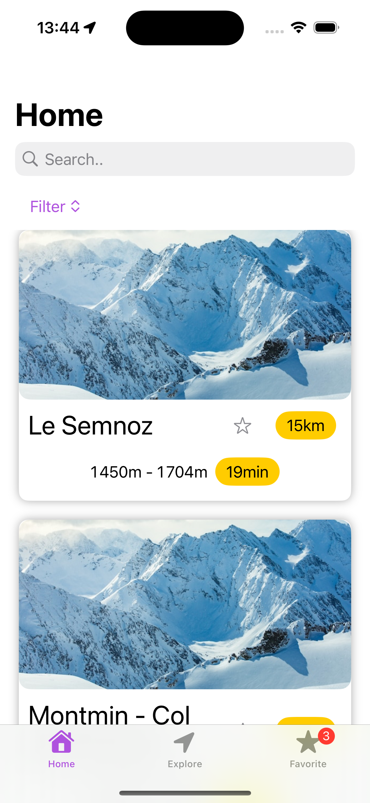
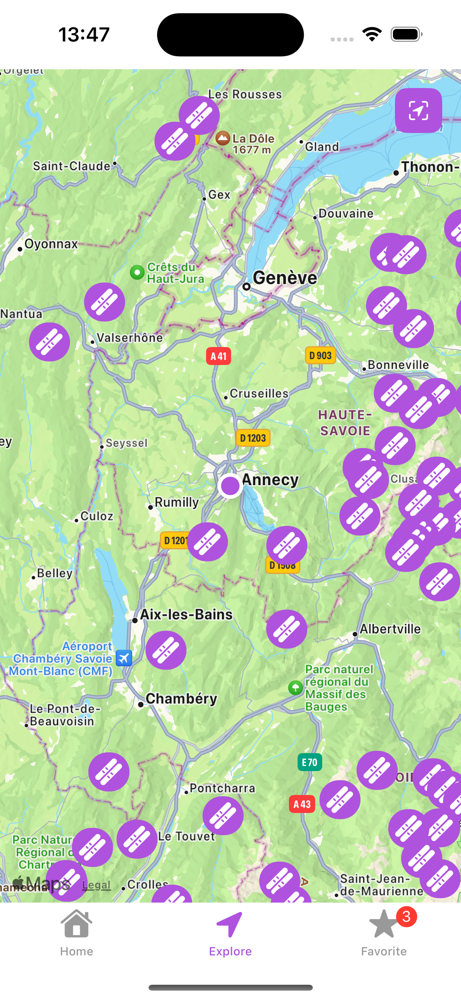
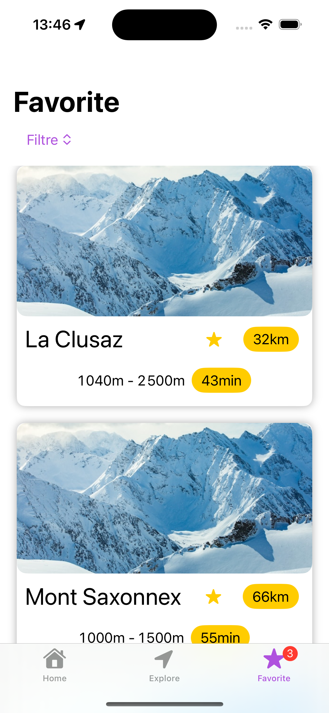
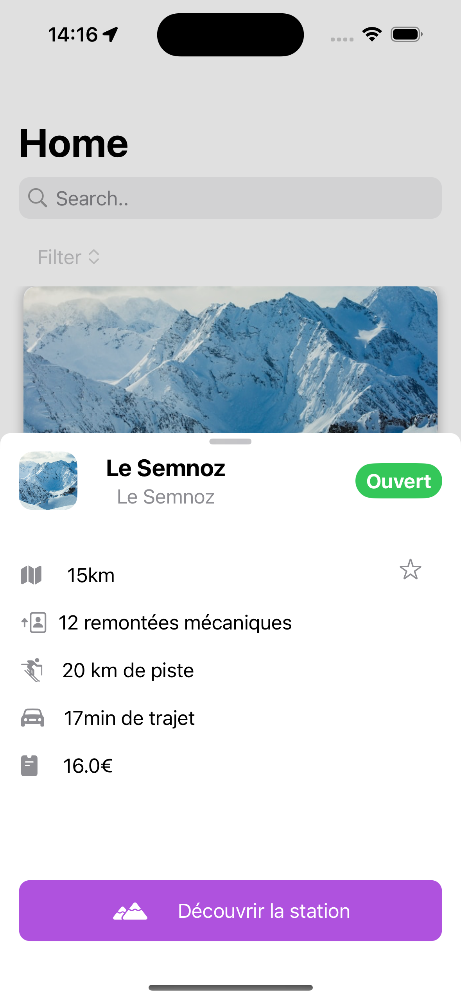
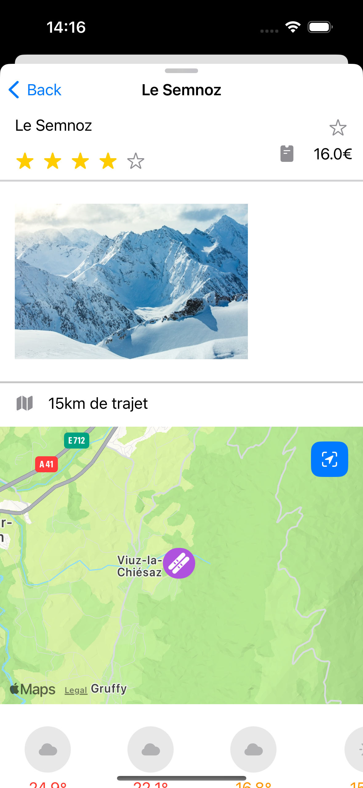

# [MDS] Swift porject from MBA2 "Développeur Full Stack"


## 📋 ToutShuss Project

|Home Screen|Map Screen|Favory Screen|Info Screen|More Info Screen|
|---|---|---|---|---|
||||||

The idea behind ToutShuss is to enable all skiers to find the ideal ski sation for their ski weekend.

### 🏠 Home Screen

List stations :
- Disctance by car 
- Driving time by car
- The favorite button
- The image of sation 

### 📍 Map Screen

Display a map with a dot on each station

### ⭐️ Favory Screen

List stations defined as favorites:
- Disctance by car 
- Driving time by car
- The favorite button
- The image of sation 


### ℹ Info Screen

Show more details about a station

### 📖 More Info Screen

Display all station information

## External tools


To display the station weather we used the OpenWeather API. <br>(https://openweathermap.org/appid)

### Add you OpenWeather API key

1- Create an OpenWeather account 

2- Create an API key

3- Open environnement.plist (/ToutShuss/environnement.plist)

4- Set the key : ``<string>YOUR_KEY</string>``
```
4 <dict>
5 	<key>OpenWeatherMap_Key</key>
6 	<string>YOUR_KEY</string>
7 </dict>
```


## Contributing

See the [specific guide](./CONTRIBUTING.md).

## Licence

This project is under the [MIT Licence](./LICENCE.md).
